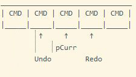

<h1 align="center">
	<a href="https://github.com/KeyC0de/CommandPattern">Command Design Pattern</a>
</h1>
<hr>


*<u>Definition</u>*:</br>
Encapsulate a request as an object, thereby letting users parameterize clients with different requests, queue or log requests, and support undoable operations.

*<u>Breakdown</u>*:</br>
You are not encapsulating the object that sends the request, or the object that receives the request, but encapsulate the actual request as an object with state.
Of course, some commands can be stateless chunks of pure behavior (no data).</br>
The command pattern also makes undoable operations a piece of cake (they're considerably harder to implement wihout it). Derived Commands can leverage Curiously Recurring Template Pattern (CRTP) to be statically bound. 

Note that the code executing the commands is responsible for freeing their memory.


### Design

- define a base class or interface (abstract class) `Command` that represents a triggerable command for the program
- create subclasses of Command, each representing a different Command to be executed and override the interface method eg. `void execute()` and optionally the undo operation `void undo()`
- create a handler class which stores a pointer for each type of possible command
- use a `executeCommand()` in the `CommandHandler` class to handle and dispatch the appropriate commands depending on the incoming requests
- you can use a switch aka an enum such as `CommandId` to differentiate between the commands in the `CommandHandler::executeCommand()`
- to support undo operations we store at the base command class the state that is being changed, ie all the state affected by the command and when `undo()` is requested we restore the oldstate. Likewise for `redo`.
- to support multiple levels of undo instead of remembering the last command, we keep a `stack<CommandType> commands;` (or `queue`) instead, and we point to the current one. When the user executes a command we push it to the stack. When the user undos we pop from the stack. When the user redos we first check if there is something to redo in the stack and proceed.

<p style="text-align: center;">
	
</p>

In my example I've used a slightly more complex version to create concrete `Command` classes. Instead of using the classic inheritance with virtual functions and making the base `Command` an interface (pure virtual) I resorted to using the Curiously Recurring Template Pattern (aka Static Polymorphism) with templates. This is in general less flexible, more complicated but more performant. However it's not too complex.

Here's a CRTP primer to see how it works:

<u>CRTP Design:</u>

- base class is a (concrete) template class
- derived class in a non-template class which derives from the base class with the template type argument being its own type
- only derived class objects can be created
- base class defines an `interface` like method which calls the appropriate `implementation` method of a derived class based on the type of the calling object. The interface and the implementation method need not have the same signature. To accomplish this at compile time the "interface" method calls the implementation method like so: `static_cast<T*>( this )->implementation( args... )`.

Blueprint:</br>

```
template<class T>
struct Base
{
	void interface()
	{
		// ...
		static_cast<T*>(this)->implementation();
		// or:
		// static_cast<Derived const&>(*this).processB();	// if your prefer by reference
		// ...
	}
};

struct Derived1 : Base<Derived1>
{
	void implementation() {
		// ...
	}
};

struct Derived2 : Base<Derived2>
{
	void implementation() {
		// ...
	}
};
```

CRTP Benefits:</br>
+ All benefits of dynamic (actual) polymorphism without additional performance cost</br>
+ The client still sees and uses the polymorphic function as an actual polymorphic function, having no idea about its templatedness

CRTP Disadvantages:</br>
- larger image size due to templatized code</br>
- Virtual methods are more powerful in the sense that, unlike the CRTP, they are able to discover the implementation of an interface at each runtime call. This is dynamic polymorphism. Each object* can change the implementation by newing a new OtherDerivedClass(); and then running a function on it. With CRTP we get static polymorphism B is A, but it can't change to C (which also inherits from A) during runtime.

I used Windows 8.1 x86_64, Visual Studio 2017, C++17 to build the project.


# Contribute

Please submit any bugs you find through GitHub repository 'Issues' page with details describing how to replicate the problem. If you liked it or you learned something new give it a star, clone it, laugh at it, contribute to it whatever. I appreciate all of it. Enjoy.


# License

Distributed under the GNU GPL V3 License. See "GNU GPL license.txt" for more information.


# Contact

email: *nik.lazkey@gmail.com*</br>
website: *www.keyc0de.net*
